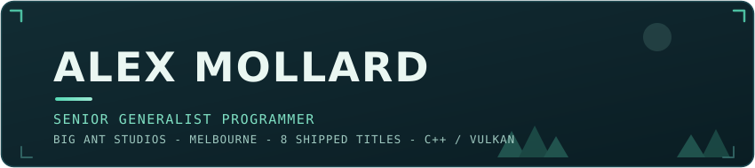

I build the systems a game is made of: Vulkan rendering, engine architecture, 
netcode, and the tools the rest of the team works in.

[alexmollard.dev](https://www.alexmollard.dev) &nbsp;·&nbsp; [CV](https://www.alexmollard.dev/alex-mollard-cv.pdf) &nbsp;·&nbsp; [LinkedIn](https://au.linkedin.com/in/alex-mollard) &nbsp;·&nbsp; [Email](mailto:alexmollard@protonmail.com)

### Shipped at Big Ant Studios

Eight PC, PlayStation and Xbox titles since 2022, working across UI, gameplay, networking, platform certification and internal tooling.

| Year | Titles |
| :--- | :--- |
| 2025 | Cricket 26 · Rugby League 26 · AFL 26 · Rugby 25 |
| 2024 | TIEBREAK |
| 2023 | Cricket 24 · AFL 23 |
| 2022 | Cricket 22 |

### Outside work

I build my own C++/Vulkan engines, because the fastest way to learn an engine is to write one. The current one is [AetherCore](https://github.com/AlexMollard/AetherCore): a Vulkan engine with a GPU-driven renderer, an editor-first workflow and hot-reloadable C# gameplay.

### Stack

- **Languages:** C++, C#, Rust, Python, GLSL/HLSL
- **Graphics:** Vulkan, OpenGL, render graphs, bindless rendering, PBR
- **Engines and systems:** Unreal Engine 5, Unity, ENet, Jolt, ECS
- **Platforms and tooling:** PC, PlayStation, Xbox, TRC certification, PlayFab, Steamworks, Tracy, CMake

 

<picture>
  <source media="(prefers-color-scheme: dark)" srcset="https://raw.githubusercontent.com/AlexMollard/AlexMollard/output/github-contribution-grid-snake-dark.svg" />
  
</picture>
